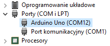

---
title: "Ćwiczenie 0: Wprowadzenie"
subtitle: "Instrukcja laboratorium"
footer-left: "Instrukcja laboratorium"
author: [Mariusz Chilmon <<mariusz.chilmon@ctm.gdynia.pl>>]
lang: "pl"
titlepage: yes
titlepage-logo: "logo.png"
logo-width: "70mm"
colorlinks: yes
header-includes: |
  \usepackage{awesomebox}
...

> When the terrain disagrees with the map, trust the terrain.
>
> — _Swiss army proverb_

# Środowisko programistyczne

\begin{description}
\item[Płytka ewaluacyjna]
\textit{Arduino Uno} z procesorem ATmega328P.
\item[Kompilator]
AVR Toolchain v3.7 bazujący na kompilatorze GCC.
\item[Programator]
AVRDUDE v7.1.
\item[IDE]
Visual Studio Code (nie mylić z Visual Studio) z wtyczką \textit{C/C++} umożliwiającą nawigowanie po kodzie C i C++ oraz automatyczne uzupełnianie kodu w tych językach.
\item[Katalog roboczy]
\lstinline{Embedded} w katalogu \lstinline{Dokumenty}. Kody źródłowe ćwiczeń należy umieszczać w~\lstinline{Embedded/Code}. W \lstinline{Embedded/Datasheets} umieszczone są noty katalogowe mikrokontrolerów oraz dokumentacje płytek ewaluacyjnych.
\end{description}

# Pobieranie kodu i instrukcji do ćwiczenia

1. Wyczyść zawartość katalogu `Embedded/Code`.
1. Uruchom Visual Studio Code.
1. Wciśnij _Ctrl + Shift + P_ i wpisz polecenie _git clone_.
1. Sklonuj repozytorium Git [https://github.com/vmario/amw-embedded-lab-XX.git](https://github.com/vmario/amw-embedded-labXX.git), gdzie _XX_ to numer ćwiczenia. Nie wybieraj opcji _Clone from GitHub_, ale wpisz adres i wybierz _Clone from URL_.
1. Wybierz katalog `Embedded/Code` do zapisania projektu.

# Kompilacja programu

1. Wciśnij _Ctrl + Shift + B_ i wybierz zadanie _all_.

# Wgrywanie wsadu

1. Wciśnij _Ctrl + Shift + B_ i wybierz zadanie _program_.

\notebox{Zadanie \textit{program} przebudowuje też program wynikowy, jeżeli zostały wprowadzone jakieś zmiany w plikach źródłowych. Zatem, jeżeli chcesz skompilować program i od razu go wgrać, możesz pominąć zadanie \textit{all}.}

Jeżeli programator zgłosi problem:

```
avrdude error: cannot open port \\.\COM2: Nie mozna odnalezc okreslonego pliku.

avrdude error: unable to open programmer arduino on port \\.\COM2
```

należy ustawić odpowiedni numer portu w zmiennej `port` w pliku `.vscode/settings.json`. Aby określić numer portu, należy uruchomić _Menedżer urządzeń_, rozwinąć listę _Porty (COM i LPT)_, a następnie podłączyć płytkę ewaluacyjną i zaobserwować nowy numer portu oznaczony nazwą _Arduino Uno_ lub _Urządzenie szeregowe USB_.

{width=200px}

# Opis skonfigurowanych zadań

\begin{description}
\item[all]
Buduje program.
\item[clean]
Czyści wszystkie pliki wynikowe (usuwa efekt budowania).
\item[erase]
Czyści pamięć mikrokontrolera i wgrywa bootloader. Wymaga zewnętrznego programatora.
\item[program]
Buduje program i wgrywa go do mikrokontrolera.
\end{description}

# Ustawianie bitów w rejestrach

Aby ustawić bity, np. o numerze `2` i `3` w rejestrze `REG` można zapisać wprost wartość do rejestru:

```
REG = 0b00001100;
```

Powoduje to jednak wyzerowanie wszystkich bitów oprócz `2` i `3`. Jeżeli chcemy zachować pozostałe bity niezmienione, należy posłużyć się operatorem przypisania złożonym z operatorem alternatywy bitowej _OR_:

```
REG |= 0b00001100;
```

Jeżeli chcemy wyzerować bity `2` i `3`, pozostawiając pozostałe niezmienione, używamy operatora przypisania złożonego z operatorem koniunkcji bitowej _AND_ i operatora negacji _NOT_:

```
REG &= ~0b00001100;
```

# Binarne formaty zapisu liczb

Język C++14 wprowadził binarny zapis liczb w postaci `0b00001100`. We wcześniejszych wersjach tego języka i w języku C (za wyjątkiem rozszerzeń wprowadzanych przez pewne kompilatory) taki format nie jest dostępny i zazwyczaj stosowana jest notacja szesnastkowa postaci `0x0C`. Możliwe jest też składanie liczb za pomocą operatora przesunięcia bitowego i operatora alternatywy bitowej lub, w&nbsp;przypadku kompilatora AVR-GCC, makra `_BV()`. Poniższe zapisy są zatem równoważne:

```
REG = 0b00001100;
REG = 0x0C;
REG = (1 << 2) | (1 << 3)
REG = _BV(2) | _BV(3);
```

\awesomebox[teal]{2pt}{\faCode}{teal}{Użycie operatora przesunięcia bitowego lub makra \lstinline{_BV()} umożliwia ustawianie bitu wskazanego przez zmienną, np.: \lstinline{REG |= _BV(bitNumber)}, gdzie zmienna \lstinline{bitNumber} przechowuje numer bitu, który chcemy ustawić.}
